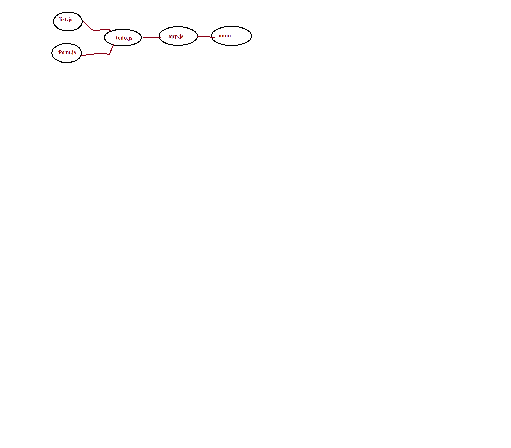

# Todo

Phase One : Begin the build of an application designed for creating and organizing a “To Do” list in your browser.

## Deploy 

(Netlify)[https://60d08339e50af86c8167087d--sad-spence-25fca1.netlify.app/]

## UML 

